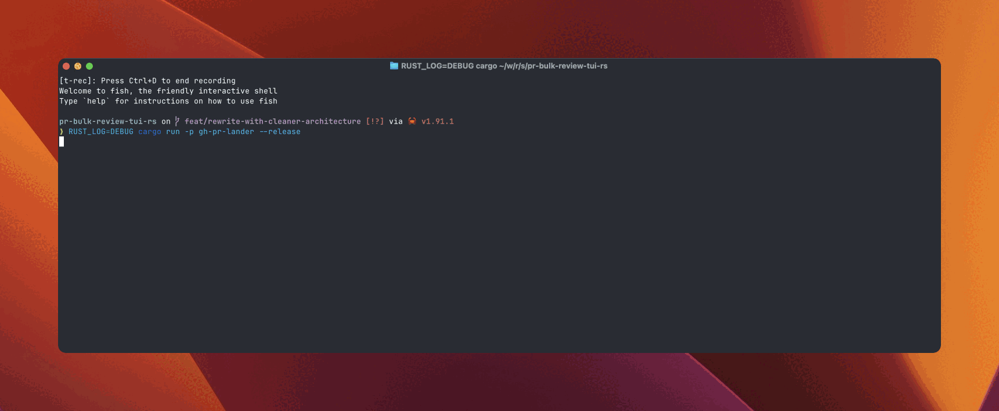

# GitHub PR Lander

A TUI for devs who review PRs faster than GitHub can load.

<!-- TODO: Consider uploading MP4 to GitHub directly for better playback -->


## Features

### Multi-repo tabs
Stop juggling browser tabs. All your repositories in one view, switch with `Tab`.

### Vim navigation
`j/k`, `gg/G`, and all the keys you expect. Your muscle memory just works.

### Bulk PR actions
Dependabot opened 15 PRs? Select all, approve, merge. Done in seconds, not minutes.

### Diff viewer
Full PR review in your terminal. Syntax highlighting, inline comments, submit reviews—no browser needed.

### Build log viewer
CI failed? Jump straight to errors with `n`. Navigate through workflows → jobs → steps in a tree.

### Command palette
Forgot a keybinding? `Ctrl+P` and fuzzy search. Every action is discoverable.

### CI status at a glance
Green check, red X, yellow spinner. Know instantly which PRs are ready to merge.

### Planned

- PR filtering by status/type
- **Merge queue** — Land PRs one-by-one with CI checks between each merge. Queue up approved PRs, and the tool merges them sequentially: merge → wait for CI → next PR. Ensures main stays green.
- Session persistence
- Live status updates

## Installation

```bash
git clone https://github.com/sassman/gh-pr-tui-rs.git
cd gh-pr-tui-rs
cargo build --release
./target/release/gh-pr-lander
```

Requires the [GitHub CLI (`gh`)](https://cli.github.com/) to be installed and authenticated.

## Quick Start

1. Launch: `./target/release/gh-pr-lander`
2. Add a repository: `r → a`
3. Navigate PRs: `j/k` or arrow keys
4. Select PRs: `Space`
5. Merge selected: `p → m`
6. View diff: `d → d`
7. View build logs: `p → l`
8. Open command palette: `Ctrl+P`

## Key Bindings

### Navigation

| Key | Action |
|-----|--------|
| `j` / `↓` | Next item |
| `k` / `↑` | Previous item |
| `gg` | Go to top |
| `G` | Go to bottom |
| `Tab` | Next repository |
| `Shift+Tab` | Previous repository |

### PR Actions

| Key | Action |
|-----|--------|
| `Space` | Toggle selection |
| `Ctrl+A` | Select all |
| `u` | Deselect all |
| `Enter` | Open in browser |
| `p → m` | Merge |
| `p → a` | Approve |
| `p → c` | Comment |
| `p → d` | Request changes |
| `p → x` | Close |
| `p → r` | Rebase / update branch |
| `p → l` | View build logs |
| `p → i` | Open in IDE |
| `d → d` | View diff |
| `Ctrl+R` | Refresh PRs |

### Views & Panels

| Key | Action |
|-----|--------|
| `?` | Toggle keyboard help |
| `Ctrl+P` | Command palette |
| `` ` `` | Toggle debug console |
| `q` / `Esc` | Close / go back |
| `Ctrl+C` | Quit |

### Repository

| Key | Action |
|-----|--------|
| `r → a` | Add repository |
| `r → o` | Open repo in browser |

### Build Log Viewer

| Key | Action |
|-----|--------|
| `n` | Jump to next error |
| `N` | Jump to previous error |
| `t` | Toggle timestamps |
| `e` | Expand all |
| `E` | Collapse all |

### Diff Viewer

| Key | Action |
|-----|--------|
| `j/k` | Navigate lines |
| `n` | Next hunk |
| `N` | Previous hunk |
| `Tab` / `Space` | Switch pane (file tree ↔ diff) |
| `h` / `l` | Focus file tree / diff content |
| `c` | Add comment on current line |
| `d → r` | Submit review (approve/request changes/comment) |

> **Full code review in terminal** — Add inline comments on any line with `c`, then submit your review with `d → r` to approve, request changes, or leave a comment. Complete PR reviews without opening a browser.

## Screenshots

<!--
TODO: Add screenshots here. Suggested:
- Main PR list view (showing repos tabs, PR list, CI status)
- Keyboard help panel (? key)
- Command palette (Ctrl+P)
- Build log viewer (optional, already in demo)
- Diff viewer (optional, already in demo)

Example format:
### Main View

*Multi-repo tabs, PR selection, and CI status indicators*
-->

## Configuration

### Repositories

Tracked repositories are stored in `.gh-pr-lander.repos.json`:

```json
[
  { "org": "your-org", "repo": "your-repo", "branch": "main" },
  { "org": "another-org", "repo": "another-repo", "branch": "develop" }
]
```

### App Settings

Create `~/.gh-pr-lander.toml` (or `.gh-pr-lander.toml` in the current directory):

```toml
# IDE to open PRs in (default: "code")
ide_command = "zed"  # or "code", "cursor", "vim"

# Directory for cloning PRs (default: system temp dir)
temp_dir = "/tmp/gh-pr-lander"

# Default messages for PR actions
approval_message = "LGTM! :rocket:"
comment_message = ""
request_changes_message = "Please address the following:"
close_message = "Closing this PR."
```

## Architecture

Clean Redux-inspired architecture with middleware, reducers, and unidirectional data flow. See [ARCHITECTURE.md](./ARCHITECTURE.md) for details.

## License

MIT

## Contributing

Contributions welcome! Please open an issue first to discuss changes.
